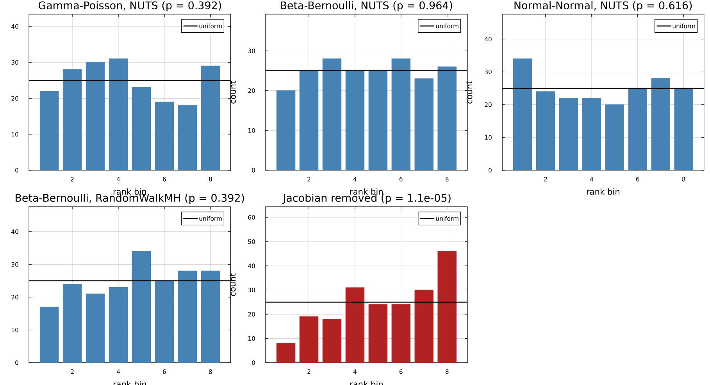
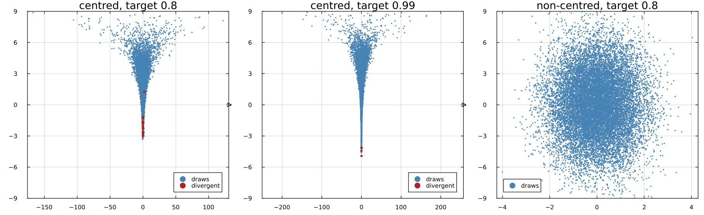

# Assay.jl

Bayesian inference implemented from first principles in Julia: MCMC (random walk
Metropolis-Hastings, HMC, NUTS), sequential Monte Carlo, mean-field and
full-rank ADVI, a model interface with a hand-written transform layer, and the
diagnostics needed to tell whether any of it is right.

An assay is the test you run to find out what something is actually made of.
That is the organising idea here: a sampler that produces numbers is easy, and
most of this repository is the apparatus for deciding whether the numbers are
the right ones.

No inference library is a dependency. ForwardDiff supplies gradients, with
ReverseDiff available through a package extension; the densities, the samplers,
the bijectors, the effective sample size and R-hat estimators are all in
[`src/`](src/). Distributions.jl and Turing.jl appear in the test suite only, as
oracles. Julia 1.10 or later; MIT licensed.

## Verification first

Anyone can write a sampler that produces numbers. These are the checks that say
the numbers are right. Every tolerance is stated in Monte Carlo standard errors,
computed from the effective sample size actually achieved, so `z` below is the
number of standard errors between the sampler and the exact answer. Full tables
and every figure: [docs/results.md](docs/results.md), regenerated end to end by
`scripts/make_results.jl`.

### Closed-form posteriors

| model | sampler | mean | exact | z | sd | exact | z |
|---|---|---:|---:|---:|---:|---:|---:|
| Beta-Bernoulli | NUTS | 0.4045 | 0.4048 | -0.84 | 0.0534 | 0.0532 | 0.89 |
| Normal-Normal | NUTS | 1.5446 | 1.5446 | 0.03 | 0.1133 | 0.1131 | 0.37 |
| Gamma-Poisson | NUTS | 3.8837 | 3.8852 | -1.06 | 0.2519 | 0.2524 | -0.55 |

Also checked for random walk Metropolis, HMC, SMC and ADVI, on mean, standard
deviation and the 2.5%, 50% and 97.5% quantiles. SMC's log normalising constant
is checked against the analytic evidence separately: within 0.03 nats at 4000
particles, with the error falling as `1 / sqrt(N)`.

### Simulation based calibration

Rank of the prior draw among 64 thinned posterior draws, over 200 replications.
Uniform ranks are what a correct sampler produces.

| problem | sampler | chi-square | p |
|---|---|---:|---:|
| Gamma-Poisson | NUTS | 7.36 | 0.39 |
| Beta-Bernoulli | NUTS | 1.92 | 0.96 |
| Normal-Normal | NUTS | 5.36 | 0.62 |
| Beta-Bernoulli | random walk | 7.36 | 0.39 |
| **Gamma-Poisson with the Jacobian term removed** | NUTS | 35.12 | **0.000011** |



The last row is the point of the exercise. Removing the log absolute Jacobian
determinant from the positive transform leaves a sampler that looks entirely
healthy - no divergences, R-hat 1.00, a sensible acceptance rate - and returns a
plausible wrong answer. It is, exactly, a correct sampler for
`Gamma(a + S - 1, b + n)` instead of `Gamma(a + S, b + n)`. Calibration rejects
it at `p = 1e-5`; the Geweke joint distribution test rejects it at `z = -42`.

### Hard geometries

Neal's funnel. The marginal of `v` is exactly `Normal(0, 3)`, so the failure is
measurable rather than illustrative.

| parameterisation | target accept | sd of v (exact 3) | divergences | ESS of v |
|---|---:|---:|---:|---:|
| centred | 0.8 | 2.35 | 124 | 80 |
| centred | 0.99 | 2.53 | 6 | 182 |
| non-centred | 0.8 | 3.01 | 0 | 25485 |



Red points are divergent transitions. The same story holds for the banana, where
the default step size understates `sd(x2)` by 21% with 427 divergences, a dense
metric does not help because the problem is local curvature, and either a
smaller step size or a reparameterisation fixes it.

### Negative controls

A test suite that only ever passes proves nothing. Four deliberate bugs, each
installed through a documented extension point rather than by editing the
library:

| control | effect | caught by |
|---|---|---|
| Jacobian term removed | targets `Gamma(a + S - 1, b + n)`, 17 standard errors off | conjugate check, SBC, Geweke |
| Metropolis correction removed | posterior mean `5.8e23` against a true 3.05 | anything |
| gradient scaled by 1.1 | nothing measurable | nothing - see below |
| gradient scaled by 3 | effective sample size per gradient falls 16000-fold | R-hat and efficiency |
| U-turn criterion that never fires | 10 times fewer effective draws per gradient | efficiency only |

The third and fifth rows are findings, not gaps. The leapfrog map is reversible
and volume preserving whatever force it integrates, and the acceptance step uses
the true log density, so an error in the gradient or in the stopping rule cannot
change the invariant distribution. It can only waste work.

### Independent oracles

Posterior means agree with Turing.jl within 4 combined standard errors on
Beta-Bernoulli, a linear regression with a positive scale, and eight schools
non-centred. The effective sample size and R-hat implementations agree with
MCMCChains to 10% and 2% on the same chains. The effective sample size estimator
matches the AR(1) closed form at `r = 0, 0.5, 0.9` and, importantly, at
`r = -0.5`, where the antithetic chain carries more information than its length
and a naive clamp at `n` would silently truncate it.

### Two real bugs this suite caught

Recorded because they are the argument for the suite existing.

1. The effective sample size estimator omitted the lag-zero term of Geyer's
   initial positive sequence, so independent draws reported five times too many
   effective samples. Found by checking against the AR(1) closed form.
2. NUTS applied the cross-subtree termination checks inside the recursion but not
   at the outermost doubling, making the stopping rule depend on the order the
   trajectory was grown. Every diagnostic looked healthy while the standard
   deviation of a `rho = 0.95` Gaussian came out 2 to 4% low, `z = -7`. Found by
   checking a hard geometry against its closed form, and now a regression test.

## What is implemented

**Model interface and transforms.** Named parameters with per-parameter
transforms: log for positive, logit for the unit interval and for bounded
intervals, stick-breaking for the simplex, and an ordered transform. Each
computes its own log absolute Jacobian determinant, checked against automatic
differentiation and against quadrature. The user writes the log joint in the
constrained space; the library owns the map to `R^n`.

**MCMC.** Random walk Metropolis-Hastings with Robbins-Monro scale adaptation,
optional adaptive proposal covariance, and a pluggable acceptance rule
(Metropolis or Barker). HMC with a leapfrog integrator and optional trajectory
jitter. NUTS with recursive doubling, biased progressive sampling at the top
level and multinomial sampling within subtrees, and three termination criteria
(classic, generalised, generalised with the cross-subtree checks). Unit,
diagonal and dense metrics, dual-averaged step size, and Stan's windowed warmup
schedule. Divergence detection throughout.

**SMC.** Sequential importance sampling with adaptive tempering chosen by
bisection on the effective sample size, four resampling schemes (multinomial,
stratified, systematic, residual), effective-sample-size-triggered resampling,
MCMC rejuvenation by any sampler in the package, and a log normalising constant
estimate.

**VI.** Mean-field and full-rank ADVI on the unconstrained space, with the
reparameterisation gradient, Adam, Polyak-Ruppert averaging of the iterates, and
a convergence rule evaluated on common random numbers. Reports the ELBO trace.

**Diagnostics.** Rank-normalised split R-hat, bulk and tail effective sample
size with Geyer truncation, Monte Carlo standard errors, divergence counts and
the Bayesian fraction of missing information.

**Verification tools.** Simulation based calibration and the Geweke joint
distribution test are part of the library, not just the test suite, so they can
be run against a user's own model.

**Sum-product networks.** Sums, products and univariate leaves, with
completeness and decomposability checked at construction, exact marginalisation
by setting a leaf to `missing`, and ancestral sampling. Marginals are verified
against numerical integration of the network's own joint density, and against
exhaustive enumeration for discrete leaves. The sum weights live on a simplex,
so inferring them is an ordinary model in this package - and simulation based
calibration on that inference passes, in a setting with no closed form.

**A dynamical system on the probability simplex.** The replicator map
`x_{t+1} = normalise(x_t .* exp(f))` observed through multinomial counts, with
the initial state as a simplex parameter and the fitness vector identified by
pinning one component. Verified by parameter recovery and by simulation based
calibration of the whole model, which is what exercises the simplex transform
and its Jacobian end to end.

## Quick start

```julia
using Assay

data = [1, 0, 1, 1, 0, 1, 1, 1, 0, 1]

model = Model((p = unit(),),
              theta -> logpdf(Beta(2, 2), theta.p) +
                       loglikelihood(Bernoulli(theta.p), data))

chain = sample(model, NUTS(), 2000; n_warmup = 1000, n_chains = 4)
summarize(chain)
```

```
parameter          mean        std       mcse       2.5%        50%      97.5%  ess_bulk  ess_tail    rhat
p                0.6408     0.1241     0.0021     0.3866     0.6485     0.8575      3330      4506   1.001
divergences: 0   mean accept: 0.885   time: 1.58s
```

The exact posterior here is `Beta(9, 5)`: mean 0.6429, standard deviation
0.1245.

Constrained parameters, sequential Monte Carlo with an evidence estimate, and
variational inference:

```julia
y = randn(50) .* 2.0 .+ 1.0

model = Model((mu = unconstrained(), sigma = positive(), w = simplex(3)),
              theta -> logpdf(Normal(0, 5), theta.mu) +
                       logpdf(Gamma(2, 1), theta.sigma) +
                       logpdf(Dirichlet([2.0, 2.0, 2.0]), theta.w) +
                       loglikelihood(Normal(theta.mu, theta.sigma), y))

chain = sample(model, NUTS(; metric = :dense), 2000)   # w[1], w[2], w[3] sum to 1
vi    = sample(model, ADVI(; family = FullRank()))     # vi.elbo_trace
```

Sequential Monte Carlo needs the prior and the likelihood separately, so it takes
a `TemperedModel` and returns an estimate of the log evidence with the particles:

```julia
prior = Model((p = unit(),), theta -> logpdf(Beta(2, 2), theta.p))
tm    = TemperedModel(prior, theta -> loglikelihood(Bernoulli(theta.p), data);
                      prior_rand = rng -> (p = rand(rng, Beta(2, 2)),))

result = sample(tm, SMC(; n_particles = 2000))
result.logZ, weighted_mean(result, :p)        # (-6.982, 0.643); exact log Z is -6.978
```

## Layout

The layering is strict and one directional. A transform knows nothing about
models, a model knows nothing about samplers, and a sampler sees only a log
density and a gradient on `R^n`.

```
src/
  utils.jl              logistic, logit, log1pexp, logsumexp
  densities.jl          hand-written log densities, samplers, cdfs
  transforms.jl         bijectors and their log Jacobian determinants
  ad.jl                 gradient backends
  model.jl              the model interface
  chains.jl             output container and summaries
  diagnostics.jl        R-hat, ESS, MCSE, BFMI
  conjugate.jl          reference problems with closed-form posteriors
  calibration.jl        simulation based calibration, Geweke
  spn.jl                sum-product networks
  simplex_dynamics.jl   replicator dynamics on the simplex
  samplers/
    interface.jl        the sampler contract and the generic driver
    mh.jl  hmc.jl  nuts.jl  smc.jl  advi.jl
```

Adding a sampler is adding a file in `samplers/`: three methods and no changes
anywhere else.

## Running things

```bash
julia --project=. -e 'using Pkg; Pkg.test()'                  # full suite, about 4 minutes
julia --project=scripts -t 4 scripts/make_results.jl          # regenerates docs/results.md
julia --project=bench -t 4 bench/benchmarks.jl                # regenerates docs/benchmarks.md
```

## Test suite

676 assertions, about 7 minutes on 4 threads - of which roughly 3 are Julia
recompiling after the suite loads Turing and ReverseDiff, which is why those two
files are included last:

| file | what it establishes |
|---|---|
| `test_utils.jl`, `test_densities.jl` | numerics in the tails; every density against Distributions.jl; every sampler against its own density |
| `test_transforms.jl` | round trips, Jacobians against automatic differentiation, pushforward densities integrating to one |
| `test_model.jl`, `test_ad.jl` | log density and gradient, with and without the Jacobian term; forward, reverse and finite-difference backends agreeing |
| `test_mh_conjugate.jl`, `test_hmc_nuts.jl` | closed-form posteriors for every sampler, adaptation, metrics, divergence reporting |
| `test_smc.jl`, `test_advi.jl` | unbiased resampling, the tempering schedule, log evidence, the ELBO bound, the mean-field variance deficit |
| `test_diagnostics.jl` | ESS against AR(1) theory, split R-hat, rank normalisation, coverage of the Monte Carlo standard error |
| `test_calibration.jl` | simulation based calibration and Geweke for three models and two samplers |
| `test_negative_controls.jl` | four deliberate bugs and what does or does not catch each |
| `test_geometries.jl` | funnel, correlated Gaussian and banana against closed forms, including the NUTS termination regression |
| `test_spn.jl`, `test_dynamics.jl` | exact marginalisation, structural validation, and calibration of two non-conjugate models |
| `test_turing.jl` | agreement with Turing.jl and with MCMCChains, on models with no closed form |

## Documents

* [docs/results.md](docs/results.md) - every table and figure, generated
* [docs/design-note.md](docs/design-note.md) - why the model interface and the
  transform layer are shaped this way, and what a full probabilistic programming
  language would add
* [docs/status.md](docs/status.md) - what is verified, what is inferred, what is
  open, what is deliberately out of scope
* [docs/benchmarks.md](docs/benchmarks.md) - timings, cost per effective draw,
  gradient cost by backend and dimension
