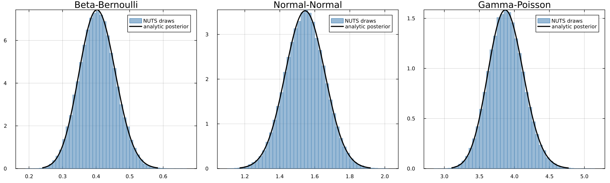
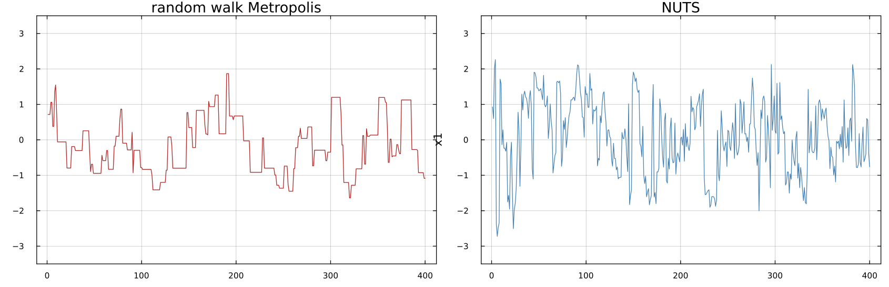
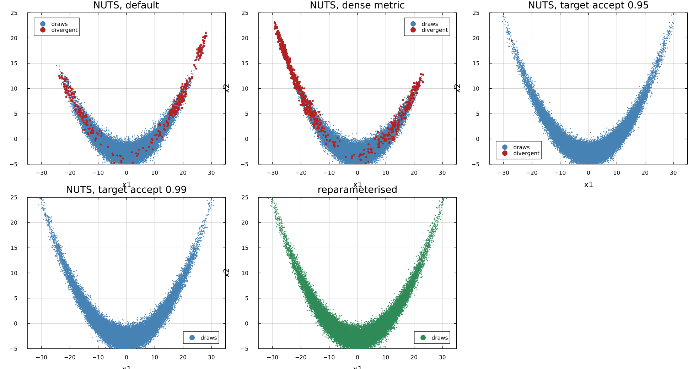
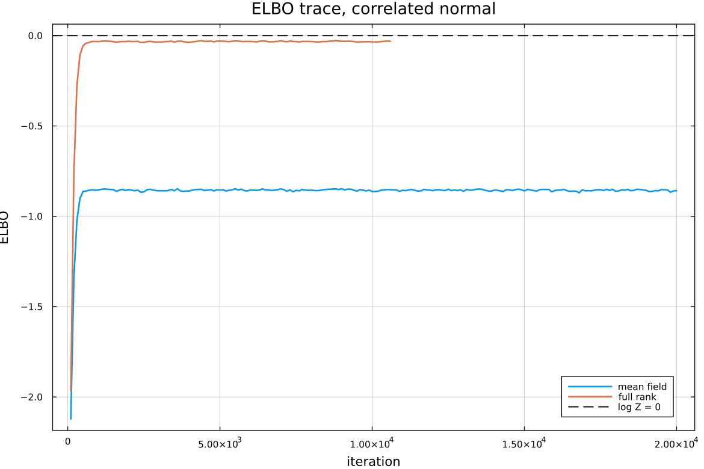
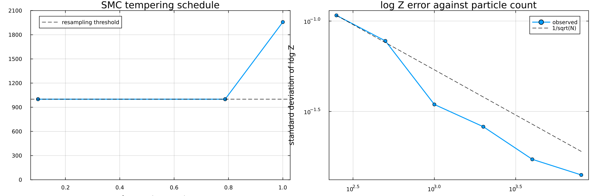
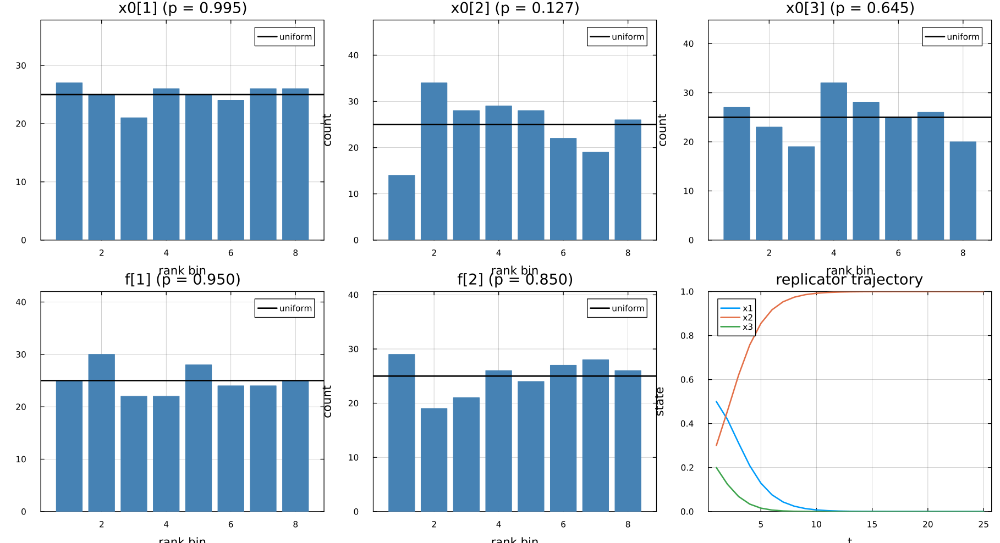

# Results

Generated by `julia --project=scripts -t 4 scripts/make_results.jl`. Every table and figure below is produced by that script from the code in `src/`; nothing here is transcribed by hand.

Contents: conjugate comparisons, simulation based calibration, the Geweke joint distribution test, hard geometries, negative controls, the diagnostics themselves, variational inference, sum-product networks, and a dynamical system on the simplex.

## 1. Conjugate models: sampled against closed form

Every tolerance is stated in Monte Carlo standard errors, so `z` is the number of standard errors between the sampler and the exact answer. Values beyond about 4 would be a failure.

| model | parameter | sampler | mean | exact | z | sd | exact | z | ESS | R-hat |
|---|---|---|---:|---:|---:|---:|---:|---:|---:|---:|
| Beta-Bernoulli | p | RWM | 0.4040 | 0.4048 | -1.52 | 0.0531 | 0.0532 | -0.42 | 12323 | 1.000 |
| Beta-Bernoulli | p | HMC | 0.4047 | 0.4048 | -0.14 | 0.0531 | 0.0532 | -0.36 | 145089 | 1.000 |
| Beta-Bernoulli | p | NUTS | 0.4045 | 0.4048 | -0.84 | 0.0534 | 0.0532 | 0.89 | 29176 | 1.000 |
| Beta-Bernoulli | p | SMC (4000 particles) | 0.4034 | 0.4048 | - | 0.0537 | 0.0532 | - | - | - |
| Beta-Bernoulli | p | ADVI (mean field) | 0.4066 | 0.4048 | - | 0.0514 | 0.0532 | - | - | - |
| Normal-Normal | mu | RWM | 1.5449 | 1.5446 | 0.32 | 0.1121 | 0.1131 | -1.25 | 11409 | 1.000 |
| Normal-Normal | mu | HMC | 1.5446 | 1.5446 | 0.02 | 0.1127 | 0.1131 | -0.84 | 92803 | 1.000 |
| Normal-Normal | mu | NUTS | 1.5446 | 1.5446 | 0.03 | 0.1133 | 0.1131 | 0.37 | 29314 | 1.000 |
| Normal-Normal | mu | SMC (4000 particles) | 1.5414 | 1.5446 | - | 0.1127 | 0.1131 | - | - | - |
| Normal-Normal | mu | ADVI (mean field) | 1.5494 | 1.5446 | - | 0.1087 | 0.1131 | - | - | - |
| Gamma-Poisson | lambda | RWM | 3.8855 | 3.8852 | 0.10 | 0.2516 | 0.2524 | -0.40 | 12145 | 1.000 |
| Gamma-Poisson | lambda | HMC | 3.8854 | 3.8852 | 0.28 | 0.2515 | 0.2524 | -0.33 | 155401 | 1.000 |
| Gamma-Poisson | lambda | NUTS | 3.8837 | 3.8852 | -1.06 | 0.2519 | 0.2524 | -0.55 | 29650 | 1.000 |
| Gamma-Poisson | lambda | SMC (4000 particles) | 3.8835 | 3.8852 | - | 0.2524 | 0.2524 | - | - | - |
| Gamma-Poisson | lambda | ADVI (mean field) | 3.8880 | 3.8852 | - | 0.2433 | 0.2524 | - | - | - |

### Log normalising constant from SMC

SMC estimates `log p(y)` as a by-product of the tempering weights. Nothing else in the package produces this number, so it is checked against the analytic evidence directly. The spread is over 8 independent runs.

| model | particles | log Z (mean of 8 runs) | standard deviation | exact |
|---|---:|---:|---:|---:|
| Beta-Bernoulli | 500 | -55.473 | 0.069 | -55.481 |
| Beta-Bernoulli | 4000 | -55.485 | 0.021 | -55.481 |
| Normal-Normal | 500 | -60.448 | 0.097 | -60.495 |
| Normal-Normal | 4000 | -60.491 | 0.029 | -60.495 |
| Gamma-Poisson | 500 | -122.143 | 0.090 | -122.163 |
| Gamma-Poisson | 4000 | -122.165 | 0.032 | -122.163 |

## 2. Simulation based calibration

Rank of the prior draw among 64 thinned posterior draws, over 200 replications. Uniform ranks are what a correct sampler produces; the p value is a Pearson chi-square test against uniformity over 8 bins.

| problem | sampler | chi-square | p |
|---|---|---:|---:|
| Gamma-Poisson | NUTS | 7.36 | 0.3924 |
| Beta-Bernoulli | NUTS | 1.92 | 0.9641 |
| Normal-Normal | NUTS | 5.36 | 0.6161 |
| Beta-Bernoulli | RandomWalkMH | 7.36 | 0.3924 |
| Gamma-Poisson **with the Jacobian removed** | NUTS | 35.12 | 0.000011 |

The last panel is the point of the exercise. Dropping the log Jacobian determinant leaves a sampler that looks entirely healthy - no divergences, R-hat 1.00, sensible acceptance rate - and simulation based calibration rejects it at p = 1e-05 with a visibly sloped histogram.

## 3. Geweke joint distribution test

Draws from `p(theta, y)` produced two ways: independently from the prior and the forward model, and by alternating the sampler's transition kernel with a fresh data set. The `theta` marginals must agree; `z` is the difference in Monte Carlo standard errors.

The number of kernel steps per sweep is 5 for NUTS and 30 for the random walk. That is not tuning to pass: with too few steps the successive-conditional chain stays autocorrelated, its standard error is optimistic, and the test reports large `z` for a sampler that is in fact correct. The step count has to be large enough that the sweep mixes.

| problem | sampler | z (mean) | z (second moment) |
|---|---|---:|---:|
| Gamma-Poisson | NUTS | 0.33 | 0.55 |
| Gamma-Poisson | RWM | 0.24 | -0.46 |
| Beta-Bernoulli | NUTS | -1.17 | -1.20 |
| Beta-Bernoulli | RWM | -0.03 | -0.05 |
| Normal-Normal | NUTS | 1.14 | -0.02 |
| Normal-Normal | RWM | -1.97 | 0.56 |
| Gamma-Poisson **with the Jacobian removed** | NUTS | -41.82 | -38.00 |

## 4. Hard geometries

### Strongly correlated Gaussian, rho = 0.95

| sampler | sd of x1 (exact 1) | z | correlation (exact 0.95) | ESS | ESS per second |
|---|---:|---:|---:|---:|---:|
| RWM, isotropic proposal | 1.0178 | 1.79 | 0.9520 | 2399 | 6453 |
| RWM, adapted covariance | 0.9958 | -0.73 | 0.9499 | 12654 | 67239 |
| NUTS, unit metric | 1.0021 | 0.29 | 0.9502 | 8254 | 5496 |
| NUTS, diagonal metric | 0.9951 | -0.69 | 0.9495 | 8384 | 16911 |
| NUTS, dense metric | 0.9947 | -1.08 | 0.9488 | 38616 | 107143 |

### Neal's funnel, 9 lower-level parameters

The marginal of `v` is exactly its prior, `Normal(0, 3)`, which is what makes the funnel measurable rather than merely illustrative.

| parameterisation | target accept | sd of v (exact 3) | divergences | ESS of v | min BFMI |
|---|---:|---:|---:|---:|---:|
| centred | 0.8 | 2.3453 | 124 | 80 | 0.075 |
| centred | 0.99 | 2.5296 | 6 | 182 | 0.063 |
| non-centred | 0.8 | 3.0055 | 0 | 25485 | 1.083 |

### Banana, x2 | x1 ~ Normal(b (x1^2 - 100), 1) with b = 0.03

Exact marginals: `x1 ~ Normal(0, 10)` and `Var[x2] = 1 + 2 b^2 100^2 = 19.00`.

Read the 0.95 row against the 0.99 row. Raising the target acceptance rate from the default to 0.95 removes almost all the divergences, so the run looks clean, and the standard deviation of x2 is still wrong by 5 to 9 percent - 6 to 12 Monte Carlo standard errors, across several seeds. Only at 0.99 does the sampler actually recover the marginal. The absence of divergences is not evidence of correctness, and this is the cheapest demonstration of that in the repository.

| configuration | sd of x1 (exact 10) | sd of x2 over 3 seeds (exact 4.359) | divergences | ESS of x2 |
|---|---:|---:|---:|---:|
| NUTS, default | 9.306 | 3.366 to 3.682 | 234 to 656 | 903 |
| NUTS, dense metric | 9.758 | 3.094 to 5.596 | 198 to 1746 | 1211 |
| NUTS, target accept 0.95 | 9.773 | 3.965 to 4.117 | 1 to 22 | 5003 |
| NUTS, target accept 0.99 | 10.036 | 4.269 to 4.517 | 0 to 0 | 4901 |
| reparameterised, x2 = z + b(x1^2 - 100) | 10.002 | 4.432 (1 seed) | 0 | - |

## 5. Negative controls

Four deliberate bugs, each installed through a documented extension point. Two are caught loudly. Two are not caught by any correctness test, and that is a fact about Hamiltonian methods rather than a gap in the suite: the leapfrog map is reversible and volume preserving whatever force it integrates, and the acceptance step uses the true log density, so an error in the gradient or in the stopping rule cannot change the invariant distribution. Those two are caught by the efficiency numbers instead.

| control | posterior mean | z against the true posterior | detected by |
|---|---:|---:|---|
| Jacobian term removed | 3.0214 | -17.0 | conjugate check, SBC, Geweke |

The broken sampler is not merely wrong: omitting `log|dlambda/dy| = y` divides the density by `lambda`, which is exactly a shift of one in the Gamma shape, so it is a *correct* sampler for `Gamma(a + S - 1, b + n)`, mean 3.0244. The observed mean is 3.0214.

| control | effect | R-hat | detected by |
|---|---|---:|---|
| Metropolis correction removed (always accept) | posterior mean 5.83e+23 against a true 3.05 | 2.28 | anything |
| gradient scaled by 1.1 | mean z = 0.6, ESS per gradient 1.0 times lower | 1.000 | **nothing** |
| gradient scaled by 3 | mean z = -3.2, ESS per gradient 17470.8 times lower | 1.110 | R-hat, and the effective sample size per gradient |
| U-turn criterion that never fires | mean z = -0.0, ESS per gradient 10.5 times lower | 1.000 | the effective sample size per gradient only |

The gradient scaled by 3 is worth reading carefully. Its `z` of about -3 is not evidence of bias: the effective sample size has collapsed by four orders of magnitude, so the standard error in the denominator is itself unreliable, and R-hat is what flags the run. Scaled by 1.1 the sampler is indistinguishable from the correct one on every measure. An error in the gradient is an efficiency bug, and only a large one is visible at all.

## 6. Diagnostics against closed forms

The effective sample size estimator is checked against the AR(1) closed form `n (1 - r) / (1 + r)`, including the antithetic case `r < 0` where the effective sample size exceeds the number of draws - the case a naive clamp at `n` silently corrupts, and the regime NUTS actually operates in.

| AR(1) coefficient | estimated ESS | closed form |
|---:|---:|---:|
| 0.0 | 78510 | 80000 |
| 0.5 | 25615 | 26667 |
| 0.9 | 4452 | 4211 |
| 0.99 | 318 | 402 |
| -0.5 | 247565 | 240000 |

The estimate at `r = 0.99` is low by about a fifth, and that is the expected behaviour rather than an error: Geyer's initial positive sequence truncates the autocorrelation sum, which is deliberately conservative, and at `r = 0.99` the correlation time is 199 draws against a chain of 10,000 after splitting. Reporting too few effective draws is the safe direction for this estimator to err in.

## 7. Variational inference

For a bivariate normal the optimal mean-field approximation has marginal standard deviation `sqrt(1 - rho^2) = 0.436`, so the understatement of variance is a closed form to check against rather than a vague complaint.

| family | sd of x1 | expected | correlation | ELBO | exact log Z |
|---|---:|---:|---:|---:|---:|
| mean field | 0.434 | 0.436 | -0.001 | -0.8329 ± 0.0022 | 0.000 |
| full rank | 0.986 | 1.000 | 0.899 | -0.0045 ± 0.0020 | 0.000 |

The ELBO is a lower bound on `log p(y)`, which here is exactly 0. Both families respect the bound; the full-rank family gets much closer to it, because the gap is the Kullback-Leibler divergence from `q` to the posterior and mean field cannot represent the correlation.

The left panel shows the adaptive schedule holding the effective sample size at the target of half the particles. The right panel is the convergence rate of the evidence estimate: the standard deviation of `log Z` falls as `1 / sqrt(N)`, which is what a consistent particle estimator must do.

## 8. Sum-product networks

A sum-product network computes any marginal in one upward pass, provided the graph is complete and decomposable; both conditions are checked at construction. The claim to verify is that marginalisation is *exact* rather than approximate, so the network's marginal is compared against numerical integration of its own joint.

| quantity | network | numerical integration |
|---|---:|---:|
| marginal density at x1 = -1.0 | 0.07259123 | 0.07259123 |
| marginal density at x1 = 0.5 | 0.01146308 | 0.01146308 |
| marginal density at x1 = 2.5 | 0.33876381 | 0.33876381 |
| total mass | 1.00000000 | 0.99999999 |

The sum weights live on a simplex, so inferring them is an ordinary model in this package. There is no closed-form posterior, and calibration is the check: chi-square p values of 0.163 and 0.369 over 200 replications.

## 9. A dynamical system on the probability simplex

`x_{t+1} = normalise(x_t .* exp(f))` with `y_t ~ Multinomial(n, x_t)`: the initial state is a simplex parameter, the fitness vector is identified by pinning its first component, and the state must remain on the simplex for every proposal the sampler makes.

| parameter | truth | posterior mean | 2.5% | 97.5% | ESS | R-hat |
|---|---:|---:|---:|---:|---:|---:|
| x0[1] | 0.600 | 0.627 | 0.574 | 0.679 | 9213 | 1.000 |
| x0[2] | 0.300 | 0.286 | 0.239 | 0.333 | 10165 | 1.000 |
| x0[3] | 0.100 | 0.088 | 0.056 | 0.126 | 9625 | 1.000 |
| f[1] | 0.800 | 0.888 | 0.778 | 1.004 | 8936 | 1.000 |
| f[2] | -0.500 | -0.370 | -0.762 | -0.021 | 9874 | 1.000 |

Simulation based calibration over 200 replications of the whole model, which is what verifies the simplex transform end to end in a setting with no closed form:

| parameter | chi-square | p |
|---|---:|---:|
| x0[1] | 0.96 | 0.9954 |
| x0[2] | 11.28 | 0.1269 |
| x0[3] | 5.12 | 0.6453 |
| f[1] | 2.16 | 0.9505 |
| f[2] | 3.36 | 0.8498 |

